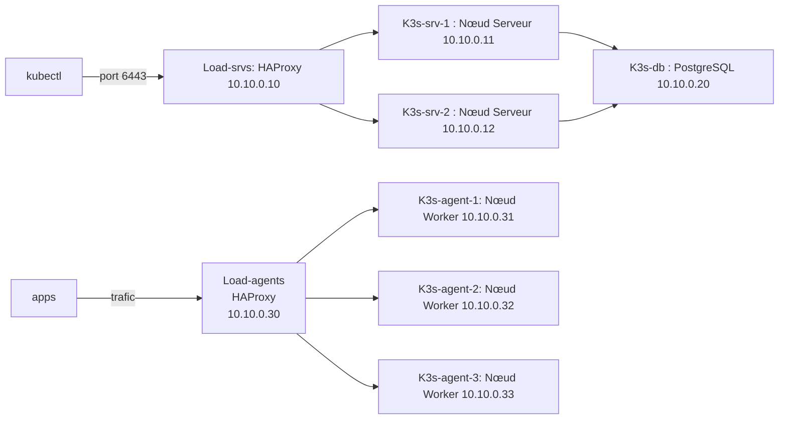

# k3s-lab

> Cluster K3s en mode Haute-Disponibilité avec datastore PostgreSQL externe.  
> Lab d'apprentissage Kubernetes sur VMs KVM locales.

---

## Architecture

---

![[Default-diagrame.png]]
## Plan d'adressage

| VM | Rôle | IP | OS |
|----|------|----|----|
| `Load-srvs` | Load Balancer — Control Plane | `10.10.0.10` | Alpine |
| `K3s-srv-1` | Nœud Serveur 1 | `10.10.0.11` | Ubuntu 22.04 |
| `K3s-srv-2` | Nœud Serveur 2 | `10.10.0.12` | Ubuntu 22.04 |
| `K3s-db` | Datastore PostgreSQL | `10.10.0.20` | Ubuntu 22.04 |
| `Load-agents` | Load Balancer — Workers | `10.10.0.30` | Alpine |
| `K3s-agent-node-1` | Nœud Worker 1 | `10.10.0.31` | Ubuntu 22.04 |
| `K3s-agent-node-2` | Nœud Worker 2 | `10.10.0.32` | Ubuntu 22.04 |
| `K3s-agent-node-3` | Nœud Worker 3 | `10.10.0.33` | Ubuntu 22.04 |

---

## Stack technique

| Composant | Rôle |
|-----------|------|
| **K3s** | Distribution Kubernetes légère (Rancher) |
| **PostgreSQL** | Datastore externe pour la HA |
| **HAProxy** | Load balancer control plane + workers |
| **Ubuntu 22.04** | OS des nœuds serveurs, agents et base de données |
| **Alpine Linux** | OS des load balancers |

---

## Documentation

| Étape | Description | Lien |
|-------|-------------|------|
| 1 | Réseau & plan d'adressage | [docs/01-reseau.md](docs/01-reseau.md) |
| 2 | Installation PostgreSQL | [docs/02-base-de-donnees.md](docs/02-base-de-donnees.md) |
| 3 | Configuration HAProxy | [docs/03-load-balancer.md](docs/03-load-balancer.md) |
| 4 | Installation nœuds serveurs | [docs/04-cluster-serveurs.md](docs/04-cluster-serveurs.md) |
| 5 | Installation nœuds agents | [docs/05-cluster-agents.md](docs/05-cluster-agents.md) |
| 6 | Premier déploiement test | [docs/06-deploiement-test.md](docs/06-deploiement-test.md) |

---

## Réseau

- **Bridge** : `virbr4`
- **Sous-réseau** : `10.10.0.0/24`
- **Passerelle** : `10.10.0.1`
- **Mode** : NAT (accès internet via le host)