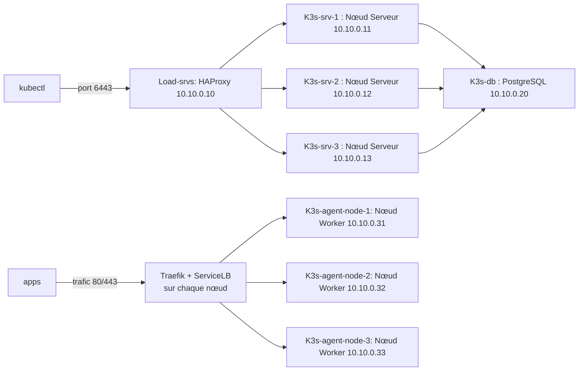
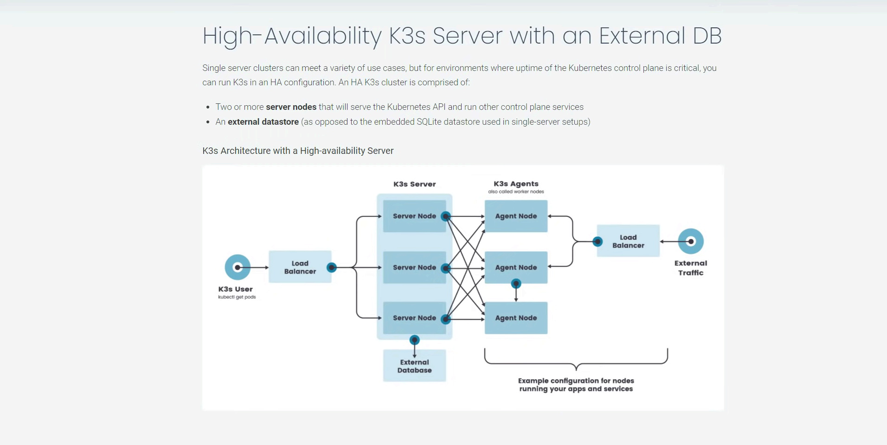

# k3s-lab

> 📦 **Projet archivé (septembre 2026).** Lab d'apprentissage terminé, conservé en lecture seule comme référence. Il est remplacé par un cluster **kubeadm** (préparation CKA) : les corrections ne sont plus appliquées ici. Les limites relevées lors de l'audit sont listées dans [Statut du projet et limites connues](#statut-du-projet-et-limites-connues) ; la suite est décrite dans [08 — Suite : du lab K3s au cluster kubeadm](docs/08-suite-kubeadm.md).

> Cluster K3s en mode Haute-Disponibilité avec datastore PostgreSQL externe.  
> Lab d'apprentissage Kubernetes sur VMs KVM locales.

---

## Architecture

```mermaid
graph LR
    kubectl -->|port 6443| LB_SRV[ Load-srvs: HAProxy 10.10.0.10]
    LB_SRV --> SRV1[K3s-srv-1 : Nœud Serveur 10.10.0.11]
    LB_SRV --> SRV2[K3s-srv-2 : Nœud Serveur 10.10.0.12]
    LB_SRV --> SRV3[K3s-srv-3 : Nœud Serveur 10.10.0.13]
    SRV1 --> DB[K3s-db : PostgreSQL 10.10.0.20]
    SRV2 --> DB
    SRV3 --> DB

    apps -->|trafic 80/443| TRAEFIK[Traefik + ServiceLB\nsur chaque nœud]
    TRAEFIK --> AGT1[K3s-agent-node-1: Nœud Worker 10.10.0.31]
    TRAEFIK --> AGT2[K3s-agent-node-2: Nœud Worker 10.10.0.32]
    TRAEFIK --> AGT3[K3s-agent-node-3: Nœud Worker 10.10.0.33]
```

> `Load-agents` (10.10.0.30) a été retiré à l'étape 7 : Traefik + ServiceLB (klipper-lb) exposent déjà les ports 80/443 sur chaque nœud.

---

## Plan d'adressage

| VM                 | Rôle                          | IP           | OS           |
| ------------------ | ----------------------------- | ------------ | ------------ |
| `Load-srvs`        | Load Balancer — Control Plane | `10.10.0.10` | Alpine       |
| `K3s-srv-1`        | Nœud Serveur 1                | `10.10.0.11` | Ubuntu 24.04 |
| `K3s-srv-2`        | Nœud Serveur 2                | `10.10.0.12` | Ubuntu 24.04 |
| `K3s-srv-3`        | Nœud Serveur 3                | `10.10.0.13` | Ubuntu 26.04 |
| `K3s-db`           | Datastore PostgreSQL          | `10.10.0.20` | Ubuntu 24.04 |
| ~~`Load-agents`~~  | ~~Load Balancer — Workers~~ (retiré, étape 7) | `10.10.0.30` | Alpine |
| `K3s-agent-node-1` | Nœud Worker 1                 | `10.10.0.31` | Ubuntu 24.04 |
| `K3s-agent-node-2` | Nœud Worker 2                 | `10.10.0.32` | Ubuntu 24.04 |
| `K3s-agent-node-3` | Nœud Worker 3                 | `10.10.0.33` | Ubuntu 24.04 |

---

## Stack technique

| Composant        | Rôle                                             |
| ---------------- | ------------------------------------------------ |
| **K3s**          | Distribution Kubernetes légère (Rancher)         |
| **PostgreSQL**   | Datastore externe pour la HA                     |
| **HAProxy**      | Load balancer du control plane (API 6443)        |
| **Ubuntu 24.04** | OS des nœuds serveurs, agents et base de données |
| **Alpine Linux** | OS des load balancers                            |

---

## Documentation

| Étape | Description                 | Lien                                                       | Status |
| ----- | --------------------------- | ---------------------------------------------------------- | ------ |
| 1     | Réseau & plan d'adressage   | [docs/01-reseau.md](docs/01-reseau.md)                     | ✅      |
| 2     | Installation PostgreSQL     | [docs/02-base-de-donnees.md](docs/02-base-de-donnees.md)   | ✅      |
| 3     | Configuration HAProxy       | [docs/03-load-balancer.md](docs/03-load-balancer.md)       | ✅      |
| 4     | Installation nœuds serveurs | [docs/04-cluster-serveurs.md](docs/04-cluster-serveurs.md) | ✅      |
| 5     | Installation nœuds agents   | [docs/05-cluster-agents.md](docs/05-cluster-agents.md)     | ✅      |
| 6     | Premier déploiement test    | [docs/06-deploiement-test.md](docs/06-deploiement-test.md) | ✅      |
| 7     | Ajout K3s-srv-3, retrait Load-agents | [docs/07-ajout-srv3.md](docs/07-ajout-srv3.md) | ✅      |
| 8     | Suite : checklist du cluster kubeadm | [docs/08-suite-kubeadm.md](docs/08-suite-kubeadm.md) | ➡️      |

---

## Réseau

- **Bridge** : `virbr4`
- **Sous-réseau** : `10.10.0.0/24`
- **Passerelle** : `10.10.0.1`
- **Mode** : NAT (accès internet via le host)

---

## Statut du projet et limites connues

Ce cluster est un **lab d'apprentissage** : il a servi à comprendre Kubernetes (HA du control plane, datastore externe, load balancing) avant de passer à un cluster **kubeadm** (préparation CKA). Il n'évoluera plus. Les points ci-dessous ont été relevés lors d'un audit (septembre 2026) et **vérifiés sur le lab** ; ils sont acceptés en l'état et servent de checklist de départ pour le cluster kubeadm.

| # | Limite | Risque | Pour le cluster kubeadm |
|---|---|---|---|
| 1 | Le ClusterRole de scraping Prometheus (K3s-lab-monitoring) inclut `nodes/proxy` : `kubectl auth can-i get nodes/proxy` répond `yes` pour son ServiceAccount | Le droit `get nodes/proxy` donne accès aux endpoints `/exec`, `/run`, `/pods` du kubelet : un token volé permet d'exécuter des commandes dans les pods | Ne donner que `nodes/metrics` (get) pour scraper `/metrics` et `/metrics/cadvisor` |
| 2 | Prometheus scrape les kubelets avec `insecure_skip_verify: true` | Le token est envoyé à quiconque répond sur `:10250` | Vérifier avec le CA du cluster (`ca_file`) |
| 3 | Le backend HAProxy de `Load-srvs` ne contient que `srv1` et `srv2` : `srv3` n'a pas été ajouté à l'étape 7 | Si srv-1 et srv-2 tombent, l'API est injoignable via le LB alors que srv-3 fonctionne | Tous les control planes derrière le LB, page de stats avec un vrai mot de passe (ici `admin:admin`) |
| 4 | Le mot de passe du datastore est passé en ligne de commande (`--datastore-endpoint=postgres://k3s:…@…`) : il est stocké dans `k3s.service` (lisible par tous) et figure dans les docs 02, 04 et 07 de ce repo public | Accès complet à l'état du cluster (Secrets non chiffrés) depuis toute machine autorisée par `pg_hba` | Secrets de config dans un fichier `0600`, chiffrement des Secrets au repos (`EncryptionConfiguration`), jamais de mot de passe dans le repo |
| 5 | `pg_hba.conf` autorise tout `10.10.0.0/24` en `md5` | N'importe quel nœud, ou un pod, peut tenter de se connecter à la base | Accès limité aux control planes, `scram-sha-256` (sans objet avec etcd) |
| 6 | `K3s-db` et `Load-srvs` n'existent qu'en un exemplaire | Points uniques de défaillance : le cluster n'est pas réellement HA | etcd empilé sur 3 control planes, LB doublé (keepalived + VIP) |
| 7 | La migration prévue vers etcd embarqué (doc 07) n'est pas possible sur place : K3s ne sait convertir que depuis SQLite, pas depuis un datastore externe | Il faudrait reconstruire le cluster | Sans objet : le cluster kubeadm part directement sur etcd |
| 8 | Versions d'OS mixtes : Ubuntu 24.04 sur 5 nœuds, 26.04 sur srv-3 | Comportements différents selon le nœud | Même image de base pour tous les nœuds |

La sécurité réseau autour du cluster (règles OPNsense par flux, isolation du bastion) est, elle, traitée et vérifiée dans [K3s-lab-monitoring](https://github.com/Souheib-h/K3s-lab-monitoring) (ADR-016 amendement, ADR-017).

