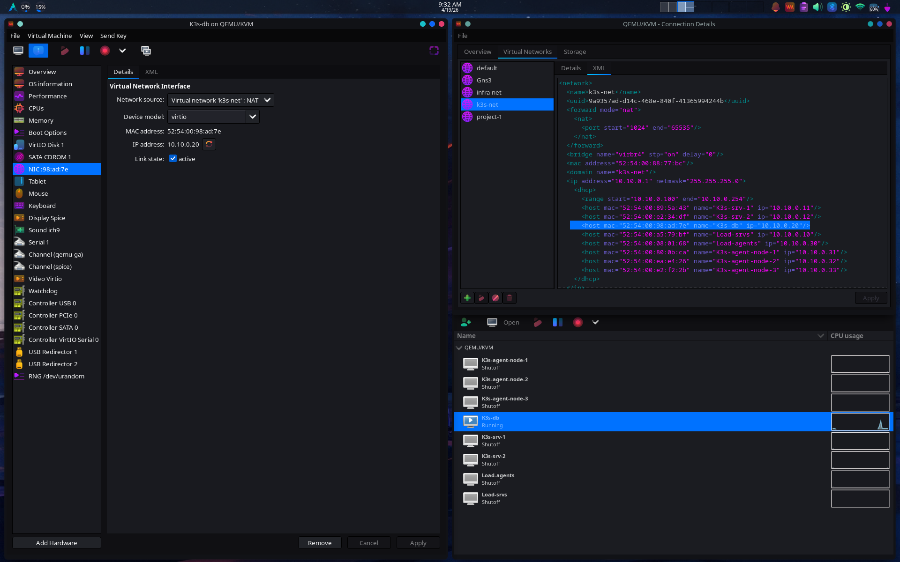

# 01 — Réseau
## Contexte

Pour isoler le cluster K3s du reste des VMs, un réseau dédié a été créé via virt-manager. Toutes les VMs du cluster communiquent exclusivement sur ce réseau.

---
## Bridge virbr4

Créé dans virt-manager :

```
Edit → Connection Details → Virtual Networks → "+"
```

|Paramètre|Valeur|
|---|---|
|Nom|k3s-net|
|Mode|NAT|
|Sous-réseau|10.10.0.0/24|
|Passerelle|10.10.0.1|
|DHCP|Activé (plage 10.10.0.100 — 10.10.0.254)|
|Bridge|virbr4|
|Autostart|Oui|

---

## Plan d'adressage

|VM|Rôle|IP|MAC|OS|
|---|---|---|---|---|
|`Load-srvs`|Load Balancer — Control Plane|`10.10.0.10`|`52:54:00:a5:79:bf`|Alpine|
|`K3s-srv-1`|Nœud Serveur 1|`10.10.0.11`|`52:54:00:89:5a:43`|Ubuntu 22.04|
|`K3s-srv-2`|Nœud Serveur 2|`10.10.0.12`|`52:54:00:e2:34:df`|Ubuntu 22.04|
|`K3s-db`|Datastore PostgreSQL|`10.10.0.20`|`52:54:00:98:ad:7e`|Ubuntu 22.04|
|`Load-agents`|Load Balancer — Workers|`10.10.0.30`|`52:54:00:08:01:68`|Alpine|
|`K3s-agent-node-1`|Nœud Worker 1|`10.10.0.31`|`52:54:00:80:0b:ca`|Ubuntu 22.04|
|`K3s-agent-node-2`|Nœud Worker 2|`10.10.0.32`|`52:54:00:ea:e4:26`|Ubuntu 22.04|
|`K3s-agent-node-3`|Nœud Worker 3|`10.10.0.33`|`52:54:00:e2:f2:2b`|Ubuntu 22.04|

---

## Config XML — k3s-net

```xml
<network>
  <name>k3s-net</name>
  <uuid>9a9357ad-d14c-468e-840f-41365994244b</uuid>
  <forward mode="nat">
    <nat>
      <port start="1024" end="65535"/>
    </nat>
  </forward>
  <bridge name="virbr4" stp="on" delay="0"/>
  <mac address="52:54:00:88:77:bc"/>
  <domain name="k3s-net"/>
  <ip address="10.10.0.1" netmask="255.255.255.0">
    <dhcp>
      <range start="10.10.0.100" end="10.10.0.254"/>
      <host mac="52:54:00:89:5a:43" name="K3s-srv-1"        ip="10.10.0.11"/>
      <host mac="52:54:00:e2:34:df" name="K3s-srv-2"        ip="10.10.0.12"/>
      <host mac="52:54:00:98:ad:7e" name="K3s-db"           ip="10.10.0.20"/>
      <host mac="52:54:00:a5:79:bf" name="Load-srvs"        ip="10.10.0.10"/>
      <host mac="52:54:00:08:01:68" name="Load-agents"      ip="10.10.0.30"/>
      <host mac="52:54:00:80:0b:ca" name="K3s-agent-node-1" ip="10.10.0.31"/>
      <host mac="52:54:00:ea:e4:26" name="K3s-agent-node-2" ip="10.10.0.32"/>
      <host mac="52:54:00:e2:f2:2b" name="K3s-agent-node-3" ip="10.10.0.33"/>
    </dhcp>
  </ip>
</network>
```

---

## Static DHCP Leases

Plutôt que de configurer une IP fixe sur chaque VM manuellement, les adresses sont réservées directement dans la config DHCP via les MAC addresses. Chaque VM démarre et reçoit automatiquement la bonne IP — config centralisée en un seul endroit.

### Vérification

```bash
sudo virsh net-dhcp-leases k3s-net
```

### Exemple — K3s-db reçoit son IP statique

