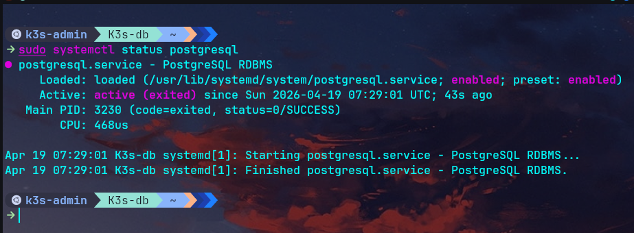
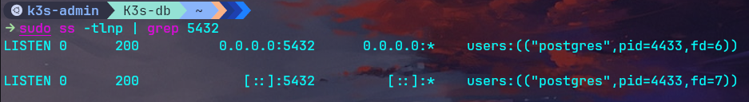
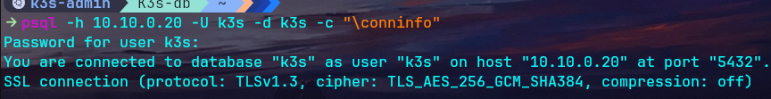

# 02 — Base de données

## Contexte

K3s en mode HA nécessite un datastore externe partagé entre tous les nœuds serveurs. SQLite (le défaut de k3s) est un fichier local — inutilisable en HA. PostgreSQL est installé sur une VM dédiée (`K3s-db`) accessible par tous les nœuds du cluster.

---

## Installation

```bash
sudo apt update && sudo apt install -y postgresql postgresql-contrib
```

### Vérification

```bash
sudo systemctl status postgresql
```



---

## Création de la base et de l'utilisateur

```bash
sudo -u postgres psql -c "CREATE USER k3s WITH PASSWORD 'k3s_password';"
sudo -u postgres psql -c "CREATE DATABASE k3s OWNER k3s;"
sudo -u postgres psql -c "GRANT ALL PRIVILEGES ON DATABASE k3s TO k3s;"
```

---

## Configuration

### Autoriser les connexions depuis le réseau k3s-net

```bash
sudo nano /etc/postgresql/16/main/pg_hba.conf
```

Ajouter en fin de fichier :

```
host    k3s     k3s     10.10.0.0/24    md5
```

### Écouter sur toutes les interfaces

```bash
sudo nano /etc/postgresql/16/main/postgresql.conf
```

Modifier :

```
listen_addresses = '*'
```

### Redémarrer PostgreSQL

```bash
sudo systemctl restart postgresql
```

---

## Vérification

### PostgreSQL écoute sur le port 5432

```bash
sudo ss -tlnp | grep 5432
```


### Test de connexion

```bash
psql -h 10.10.0.20 -U k3s -d k3s -c "\conninfo"
```

