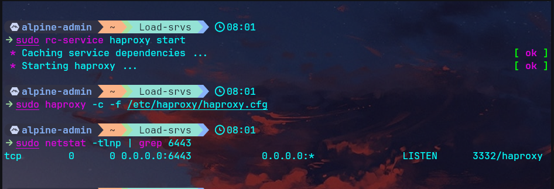
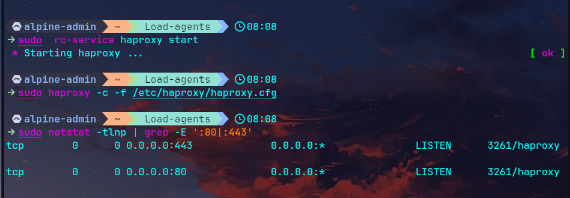

# 03 — Load Balancers HAProxy

## Architecture

| VM | Rôle | IP | LB vers |
|---|---|---|---|
| Load-srvs | LB Control Plane | 10.10.0.10 | K3s-srv-1, K3s-srv-2 |
| Load-agents | LB Workers | 10.10.0.30 | K3s-agent-node-1/2/3 |

---

## Load-srvs — Control Plane (10.10.0.10)

```bash
ssh alpine-admin@10.10.0.10
sudo apk update && sudo  apk add haproxy
sudo vim /etc/haproxy/haproxy.cfg
```

```
global
    log /dev/log local0
    maxconn 4096
    daemon

defaults
    log     global
    mode    tcp
    option  tcplog
    option  dontlognull
    timeout connect 5s
    timeout client  30s
    timeout server  30s

frontend k3s-api
    bind *:6443
    default_backend k3s-servers

backend k3s-servers
    balance roundrobin
    option tcp-check
    server srv1 10.10.0.11:6443 check
    server srv2 10.10.0.12:6443 check

listen stats
    bind *:9000
    mode http
    stats enable
    stats uri /stats
    stats refresh 10s
    stats auth admin:admin
```

```bash
sudo rc-service haproxy start 
sudo haproxy -c -f /etc/haproxy/haproxy.cfg
sudo netstat -tlnp | grep 6443
```



---

## Load-agents — Workers (10.10.0.30)

```bash
ssh alpine-admin@10.10.0.30
sudo apk update && sudo apk add haproxy
sudo vim /etc/haproxy/haproxy.cfg
```

```
global
    log /dev/log local0
    maxconn 4096
    daemon

defaults
    log     global
    mode    tcp
    option  tcplog
    option  dontlognull
    timeout connect 5s
    timeout client  50s
    timeout server  50s

frontend http-in
    bind *:80
    default_backend k3s-agents-http

frontend https-in
    bind *:443
    default_backend k3s-agents-https

backend k3s-agents-http
    balance roundrobin
    option tcp-check
    server agent1 10.10.0.31:80 check
    server agent2 10.10.0.32:80 check
    server agent3 10.10.0.33:80 check

backend k3s-agents-https
    balance roundrobin
    option tcp-check
    server agent1 10.10.0.31:443 check
    server agent2 10.10.0.32:443 check
    server agent3 10.10.0.33:443 check

listen stats
    bind *:9000
    mode http
    stats enable
    stats uri /stats
    stats refresh 10s
    stats auth admin:admin
```

```bash
sudo rc-update add haproxy default
sudo rc-service haproxy start 
sudo haproxy -c -f /etc/haproxy/haproxy.cfg
sudo netstat -tlnp | grep -E ':80|:443'
```



---
