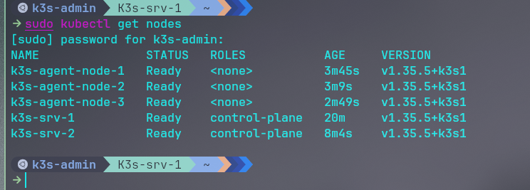

# 05 — Installation des nœuds agents (Workers)

## Architecture

| VM | Rôle | IP |
|---|---|---|
| K3s-agent-node-1 | Nœud Worker 1 | 10.10.0.31 |
| K3s-agent-node-2 | Nœud Worker 2 | 10.10.0.32 |
| K3s-agent-node-3 | Nœud Worker 3 | 10.10.0.33 |

Les workers reçoivent et exécutent les workloads (pods). Ils rejoignent le cluster via le load balancer `Load-agents` (10.10.0.30) qui pointe vers les deux control-plane nodes.

---

## Prérequis

- Cluster K3s HA opérationnel (srv-1 + srv-2 Ready)
- Token K3s récupéré depuis srv-1
- Binaire K3s copié sur chaque worker via scp

### Récupérer le token depuis srv-1

```bash
ssh -t k3s-admin@10.10.0.11 "sudo cat /var/lib/rancher/k3s/server/token"
```

### Copier le binaire sur les 3 workers (depuis le host)

```bash
# Télécharger le binaire une seule fois
curl -Lo /tmp/k3s https://github.com/k3s-io/k3s/releases/download/v1.35.5+k3s1/k3s
chmod +x /tmp/k3s

# Distribuer sur les 3 workers
for i in 31 32 33; do
  scp /tmp/k3s k3s-admin@10.10.0.$i:/tmp/k3s &
done
wait && echo "Done"

# Installer le binaire sur chaque worker
ssh -t k3s-admin@10.10.0.31 "sudo install -o root -g root -m 0755 /tmp/k3s /usr/local/bin/k3s && echo 'agent-1 OK'"
ssh -t k3s-admin@10.10.0.32 "sudo install -o root -g root -m 0755 /tmp/k3s /usr/local/bin/k3s && echo 'agent-2 OK'"
ssh -t k3s-admin@10.10.0.33 "sudo install -o root -g root -m 0755 /tmp/k3s /usr/local/bin/k3s && echo 'agent-3 OK'"
```

---

## Join des workers au cluster

Sur chaque worker :

```bash
curl -sfL https://get.k3s.io | K3S_URL="https://10.10.0.10:6443" \
  K3S_TOKEN="<token-de-srv-1>" \
  INSTALL_K3S_SKIP_DOWNLOAD=true sh -
```

> `K3S_URL` pointe vers le load balancer (10.10.0.10) et non directement vers srv-1 ou srv-2 — c'est ce qui garantit la HA côté workers.

---

## Vérification

Depuis srv-1 :

```bash
sudo kubectl get nodes
```

```
NAME               STATUS   ROLES           AGE     VERSION
k3s-agent-node-1   Ready    <none>          81s     v1.35.5+k3s1
k3s-agent-node-2   Ready    <none>          45s     v1.35.5+k3s1
k3s-agent-node-3   Ready    <none>          25s     v1.35.5+k3s1
k3s-srv-1          Ready    control-plane   17m     v1.35.5+k3s1
k3s-srv-2          Ready    control-plane   5m40s   v1.35.5+k3s1
```

