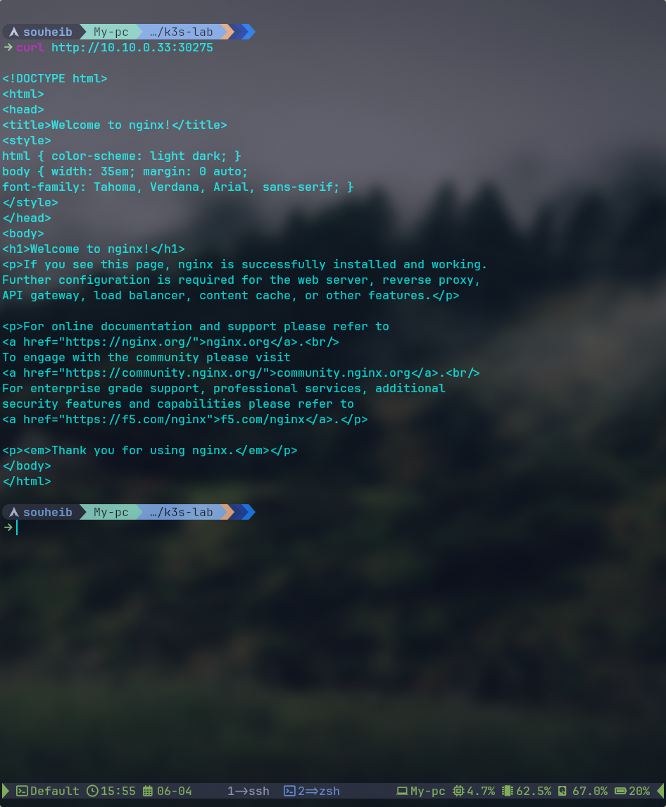
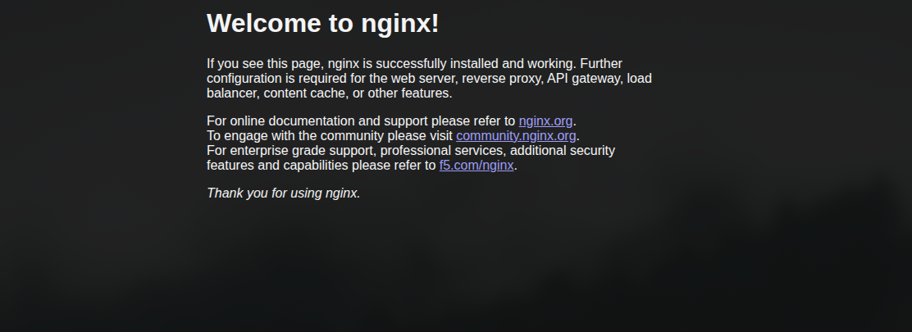

# 06 — Premier déploiement test

## Objectif

Valider le fonctionnement end-to-end du cluster en déployant un pod Nginx accessible depuis l'extérieur.

---

## Déploiement Nginx

```bash
sudo kubectl create deployment nginx --image=nginx
sudo kubectl expose deployment nginx --port=80 --type=NodePort
sudo kubectl get svc nginx
```

```
NAME    TYPE       CLUSTER-IP     EXTERNAL-IP   PORT(S)        AGE
nginx   NodePort   10.43.115.32   <none>        80:30275/TCP   0s
```

---

## Vérification

```bash
sudo kubectl get pods -o wide
```

```
NAME                     READY   STATUS    RESTARTS   AGE   IP          NODE
nginx-56c45fd5ff-sfxpj   1/1     Running   0          66s   10.42.7.3   k3s-agent-node-3
```

---

## Test HTTP depuis le host

```bash
curl http://10.10.0.33:30275
```



Réponse attendue : page HTML `Welcome to nginx!`



---

## Résultat

Le cluster K3s HA est opérationnel :

- Le pod est schedulé sur un worker par le control-plane
- Le trafic transite via `Load-agents` (HAProxy) vers le bon worker
- La réponse HTTP confirme que le networking inter-pods fonctionne